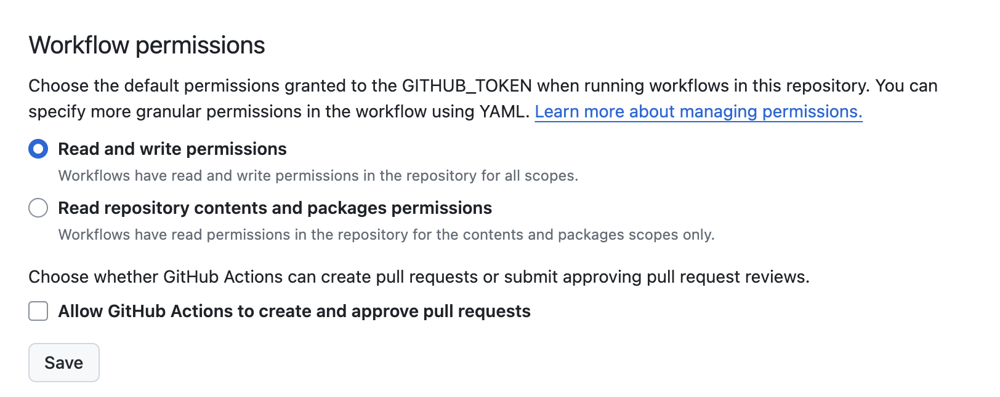

# Boilerplate python app
Boilerplate is an opinionated python app that can be installed, tested and deployed in a container.
## Write code
App code is contained in `./src` there is a default app called my_app 
## Test
Tests can be run in through `./scripts/tests.sh` which includes installation, pytest, pylint, build run tests
## Workflows
Boilerplate comes with an automated test, versioning and docker release workflow. To ensure the versioning workflow is able to run you must enabable Read and write permissions in the repository settings.
